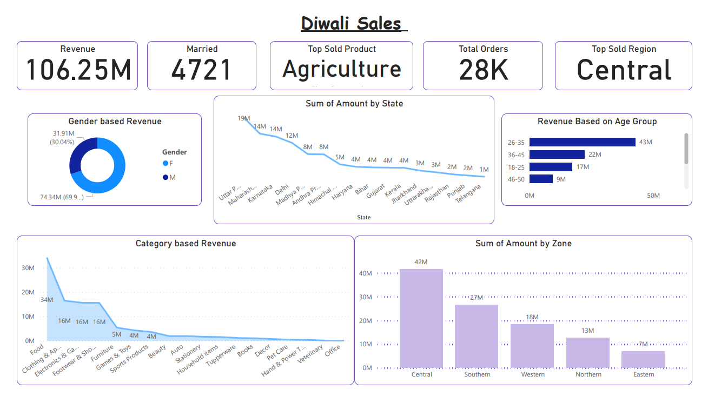

# Diwali Sales Analysis & Power BI Dashboard

**End-to-end Exploratory Data Analysis** on Diwali Sales dataset with Python and interactive Power BI visualizations.

## 📋 Project Overview

This project analyzes **28K+ Diwali sales orders** to uncover customer behavior, regional performance, product trends, and revenue insights. The goal was to deliver actionable business recommendations through clean data processing and compelling visualizations.

**Live Dashboard**: [Diwali Sales Power BI](Diwali_Sales_Analysis.pbix) *(open with Power BI Desktop)*

## ✨ What I Did

- Performed complete **data cleaning and preprocessing** on raw sales data (11251 rows × 15 columns).
- Conducted **in-depth Exploratory Data Analysis (EDA)** focusing on demographics, geography, occupation, and product categories.
- Created multiple **publication-quality visualizations** using Matplotlib and Seaborn.
- Built an **interactive Power BI dashboard** with KPIs, trends, and filters for business stakeholders.
- Derived **key insights and business recommendations** to improve future sales performance.

## 🛠 High-Level Coding & Techniques Used

- **Data Loading & Inspection**: `pandas` for reading CSV, `df.shape`, `df.info()`, `df.describe()`
- **Data Cleaning**:
  - Dropped irrelevant columns (`Status`, `unnamed1`)
  - Handled missing values (`df.dropna()`)
  - Data type conversion (`Amount` → `int`)
  - Column renaming (`Marital_Status` → `Married`)
- **Exploratory Analysis**:
  - GroupBy aggregations for sales by state, age group, gender, occupation, product category
  - Top-N analysis (`nlargest`, `sort_values`)
- **Visualization**:
  - Seaborn & Matplotlib bar plots, count plots with custom palettes
  - Advanced styling and figure sizing for professional look
- **Dashboard**: Power BI with DAX measures, slicers, and multiple chart types (Donut, Line, Bar, Cards)

## 📊 Key Insights

- **Highest Revenue**: Central Zone (₹42M)
- **Top Age Group**: 26-35 years (especially females)
- **Marital Status**: Married customers contribute significantly more
- **Top Occupations**: IT Sector, Healthcare, Aviation & Banking
- **Best Selling Category**: Food, Clothing & Apparel, Electronics & Gadgets
- **Top States**: Uttar Pradesh, Maharashtra, Karnataka

## 💡 Business Recommendations

- Focus marketing on **married women aged 26-35** in Tier-1 & Tier-2 states.
- Increase product assortment in **Food, Clothing & Electronics** categories.
- Target IT, Healthcare, and Aviation professionals with tailored offers.
- Run zone-specific campaigns, especially in Central & Southern regions.
- Reduce inventory of low-performing categories (e.g., children’s products).

## 🧰 Technologies Used

- **Python**: Pandas, NumPy, Matplotlib, Seaborn
- **Visualization**: Power BI (DAX)
- **Jupyter Notebook** for analysis and documentation

## 📁 Repository Structure
